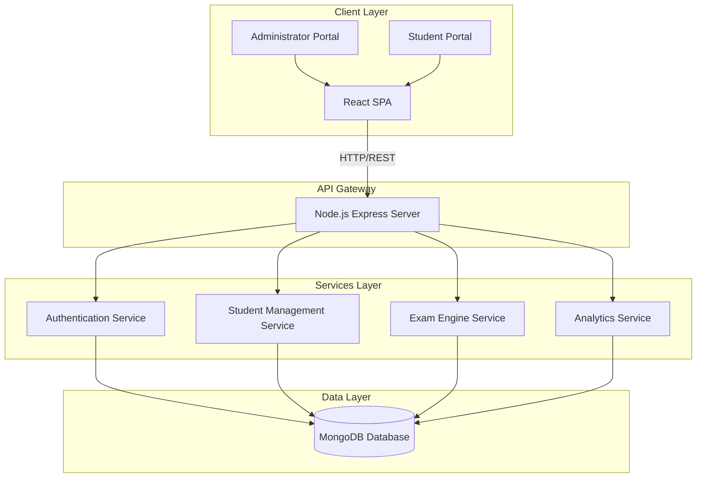
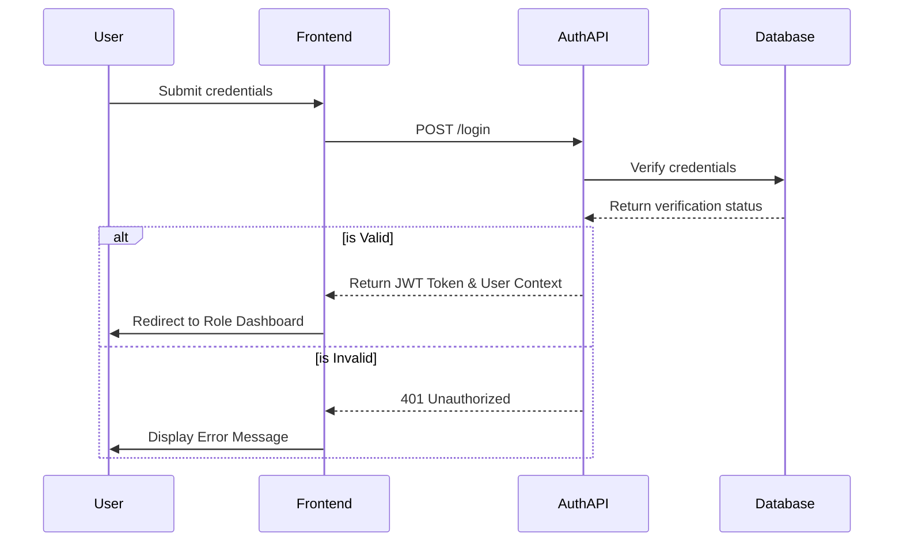
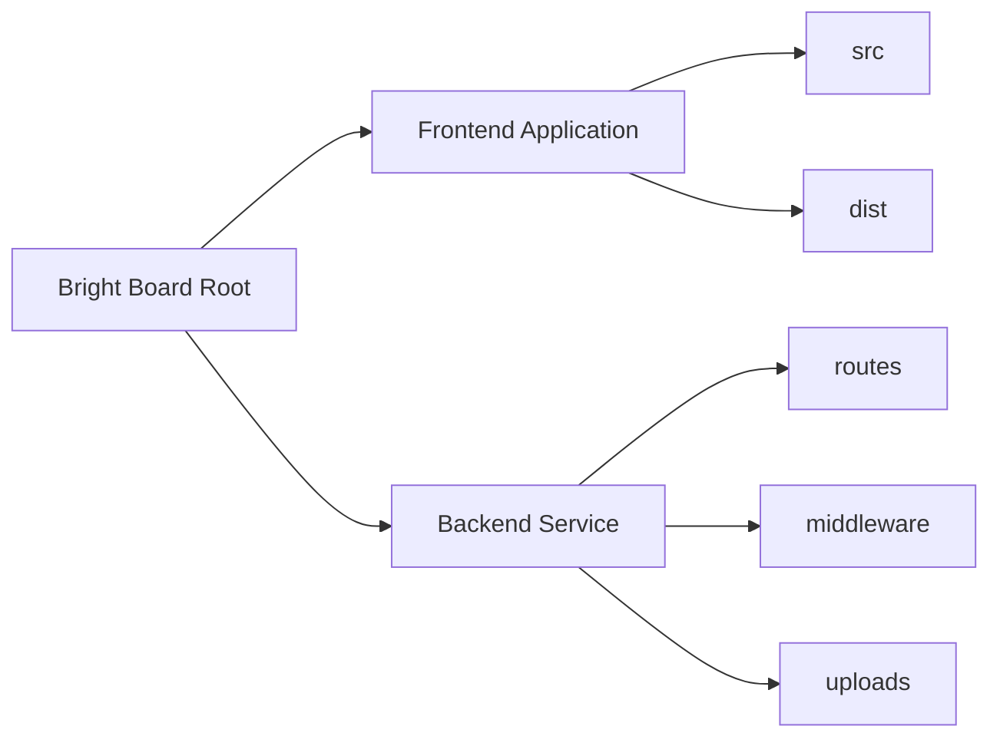

# Deployed Link:
https://brightboard-seven.vercel.app/
# Bright Board

## System Overview

Bright Board is a comprehensive Educational Technology (EdTech) management platform designed to streamline administrative workflows and enhance the student learning experience. The system is split into a robust Node.js backend API and a high-performance React.js frontend application.

## High-Level Architecture

The architecture follows a standard client-server model with a clear separation of concerns between the presentation layer and the data processing layer.

## User Access and Authentication Workflow

The system implements Role-Based Access Control (RBAC) to differentiate capabilities between administrative personnel and enrolled students.

## Directory Structure

## Deployment Guidelines

The project is configured for split deployment:
1. **Frontend**: Optimized for static hosting environments via Vite build output.
2. **Backend**: Optimized for Node.js containerized or serverless hosting environments.

For detailed instructions, refer to the individual module documentation:
- [Frontend Documentation](bright_board/Frontend/bright_board/README.md)
- [Backend Documentation](bright_board/Backend/README.md)
