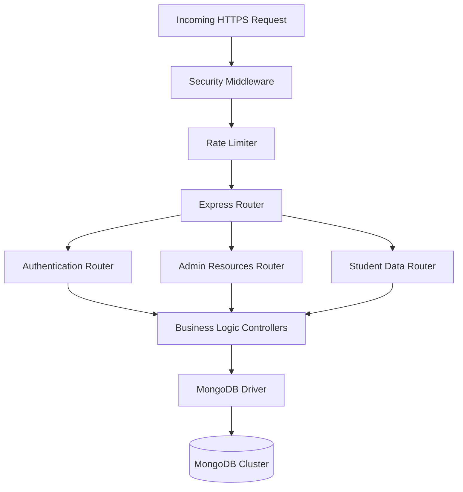
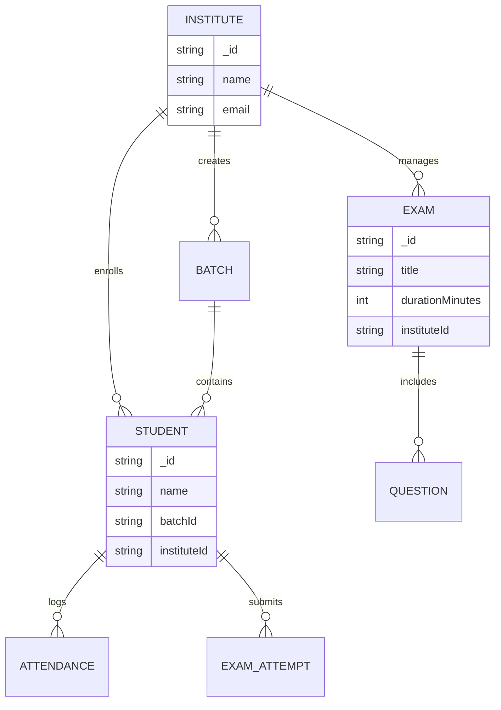
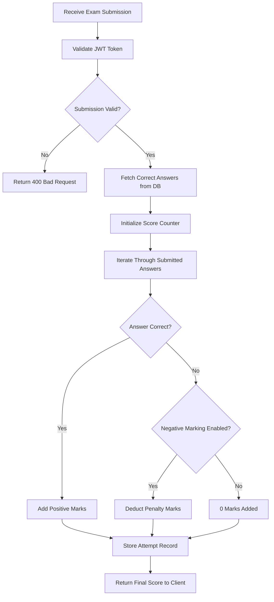
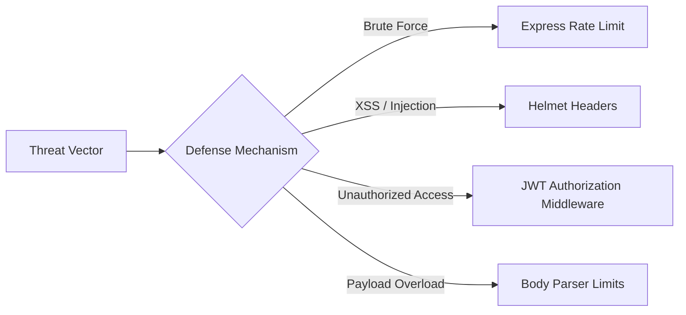

# Bright Board Backend API Service

## Technical Stack

The backend service is a RESTful API built to handle data persistence, business logic, and system security.

- **Runtime**: Node.js
- **Framework**: Express.js
- **Database**: MongoDB (Native Driver)
- **Authentication**: JSON Web Tokens (JWT)
- **Security**: Helmet, Express Rate Limit, Cors

## Core Architecture

The backend implements a standard layered architecture pattern.

## Database Schema Model

The data layer is structured to support multi-tenant relationships between the institute, students, and academic entities.

## Exam Evaluation Workflow

The backend contains specialized logic for secure and automated exam evaluation.

## Security Posture

### Development Scripts

- `npm start`: Runs the server for production.
- `npm run dev`: Runs the server with Nodemon for hot-reloading during development.
