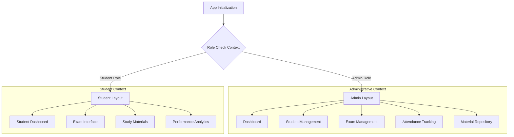
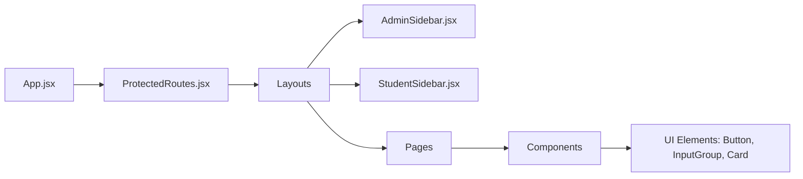
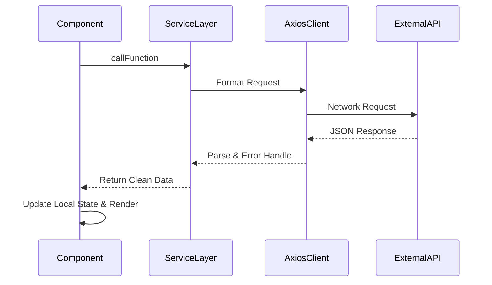
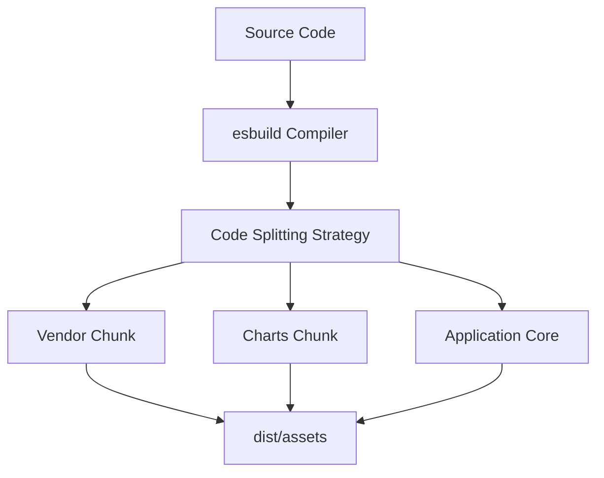

# Bright Board Frontend Application

## Technical Stack

The frontend application is a Single Page Application (SPA) built to deliver a highly responsive and state-of-the-art user interface.

- **Framework**: React.js 18
- **Build Tool**: Vite
- **Styling**: Tailwind CSS
- **Routing**: React Router DOM
- **Charts**: Recharts & Chart.js
- **Animations**: Framer Motion

## Application Architecture

The frontend is divided into two primary execution contexts: The Administrative Portal and the Student Portal.

## Component Hierarchy

## State Management and Data Flow

The application relies on a modular service architecture for API communications rather than monolithic state containers.

## Build and Compilation Process

The application utilizes Vite for rapid development and optimized production builds.

### Development Scripts

- `npm run dev`: Starts the local development server.
- `npm run build`: Compiles and minifies for production, dropping console output.
- `npm run preview`: Serves the production build locally.
